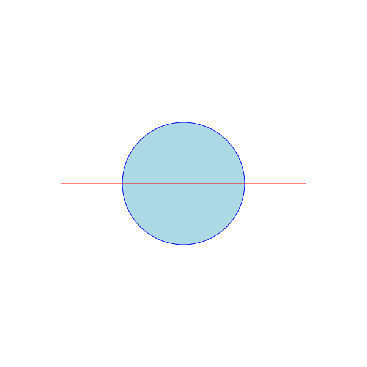
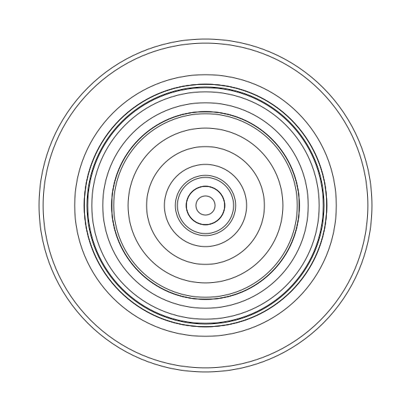
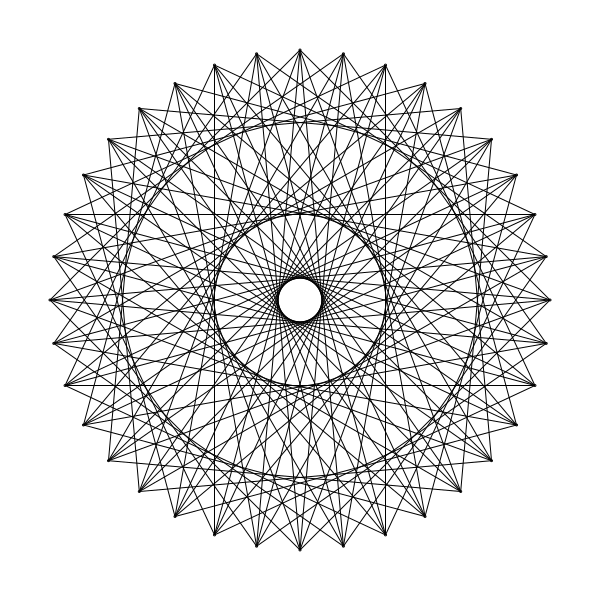

# csketch - a simple drawing library for C

csketch is a simple library for drawing shapes in C. It renders the shapes into an SVG image.

The primary goal of this library is to teach C-programming course to young aspiring programmers.

Here are some images generated with csketch.

     


## Coordinates

The library uses the conventions of the traditional coordinate system used in math. The center point of the canvas is (0, 0) and the X axis grows towards right and the Y grows towards up.

## Building the library

The sketch library can be built by running `make`. It is assumed that you are running a computer with a version of Unix and a gcc is installed.

```
$ cd sketch
$ make
gcc -c sketch.c -o sketch.o
ar rcs libsketch.a sketch.o
```

That creates the library file `libsketch.a`.

## Example: Three Circles

```c
// three circles
#include <sketch.h>

int main() {
    draw_circle(0, 0, 50);
    draw_circle(0, 0, 100);
    draw_circle(0, 0, 150);

    save_sketch("three-circles.svg");
}
```

Compile and run this program:

```
$ gcc three-circles.c -I sketch -L sketch -l sketch -o three-circles

$ ./three-circles
saved three-circles.svg
```

Open the `three-circles.svg` in file explorer.

See [examples/](examples/) directory for more examples.

## License

csketch is licensed under MIT license.
