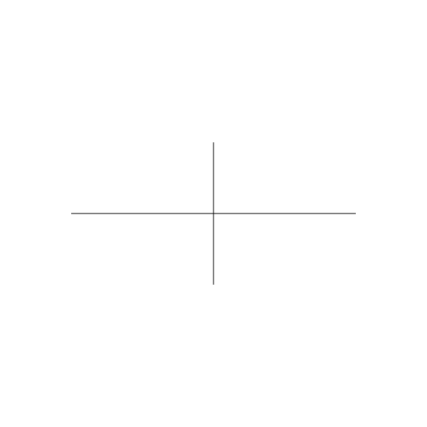
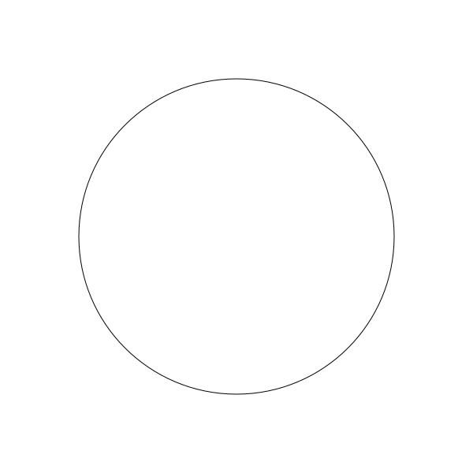
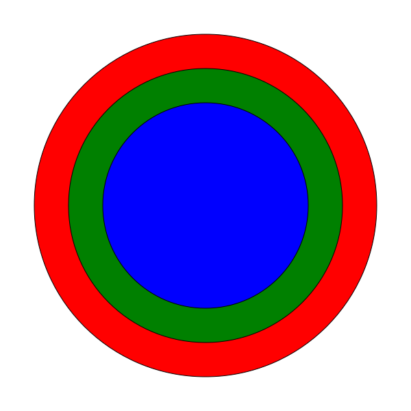
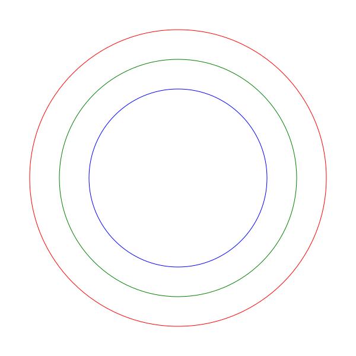
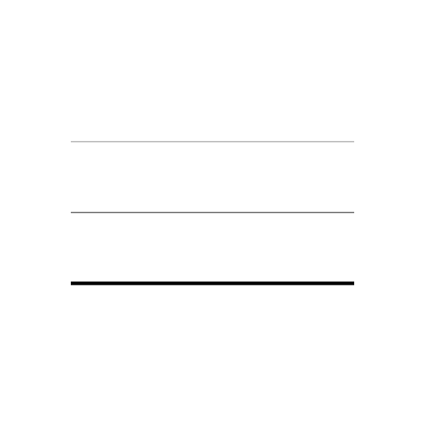
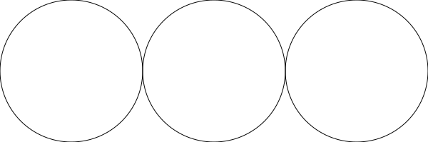

# The API

The API of _csketch_ is very simple. It has the following functions.

Drawing fuctions:

* [`draw_line`](#draw_line)
* [`draw_circle`](#draw_circle)

Style functions:

* [`set_fill`](#set_fill)
* [`set_stroke`](#set_stroke)
* [`set_stroke_width`](#set_stroke_width)

File functions:

* [`save_sketch`](#save_sketch)

Sketch Size:

* [`set_sketch_size`](#set_sketch_size)
* [`get_sketch_width`](#get_sketch_width)
* [`get_sketch_height`](#get_sketch_height)

## `draw_line`

```c
void draw_line(float x1, float y1, float x2, float y2);
```

The `draw_line` function draws a line. It takes `x1`, `y1`, `x2`, `y2` - the coordinates of the end points of the line.

```c
draw_line(-200, 0, 200, 0);
draw_line(0, -100, 0, 100);
```



## `draw_circle`


```c
void draw_circle(float x, float y, float r);
```

The `draw_circle` function draws a circle with radius `r` and center at point `(x, y)`.

```c
draw_circle(0, 0, 200);
```




## `set_fill`


```c
void set_fill(chat *color);
```

Sets the fill color. All the shapes that are drawn after calling this function will use the new fill color.


```c
set_fill("red");
draw_circle(0, 0, 150);

set_fill("green");
draw_circle(0, 0, 200);

set_fill("blue");
draw_circle(0, 0, 250);
```




## `set_stroke`

```c
void set_stroke(chat *color);
```

Sets the stroke color. All the shapes that are drawn after calling this function will use the new stroke color.


```c
set_stroke("red");
draw_circle(0, 0, 250);

set_stroke("green");
draw_circle(0, 0, 200);

set_stroke("blue");
draw_circle(0, 0, 150);
```




## `set_stroke_width`

```c
void set_stroke_width(float width);
```

Sets the stroke width. All the shapes that are drawn after calling this function will use the new storoke width.


```c
set_stroke_width(0.5);
draw_line(-200, 100, 200, 100);

set_stroke_width(1);
draw_line(-200, 0, 200, 0);

set_stroke_width(5);
draw_line(-200, -100, 200, -100);
```




## `save_sketch`

```c
void save_sketch(char *filename);
```

Saves all the shapes drawn so far to an svg file.

```c
draw_circle(0, 0, 200);
save_sketch("circle.svg");
```


## Sketch Size

By default the size of the sketch is set to `600x600`. You can change that by calling the `set_sketch_size` function. The current sketch size can be found by calling `get_sketch_width` and `get_sketch_height` functions.

### `set_sketch_size`

```c
void set_sketch_size(int width, int height);
```

Sets the size of the sketch.

```c
// set the sketch width to 600 and height to 200.
set_sketch_size(600, 200);

draw_circle(-200, 0, 100);
draw_circle(0, 0, 100);
draw_circle(200, 0, 100);

save_sketch("three-circle.svg");
```



### `get_sketch_width`

```c
int get_sketch_width();
```

Returns the curent sketch width.

```c
int w;

set_sketch_size(600, 200);

// draw a horizontal line
w = get_sketch_width();
draw_line(-w/2, 0, w/2, 0);
```


### `get_sketch_height`

```c
int get_sketch_height();
```

Returns the curent sketch height.

```c
int h;

set_sketch_size(600, 200);

// draw a vertical line
h = get_sketch_height();
draw_line(0, -h/2, 0, h/2);
```


## Colors

The `set_fill` and `set_stroke` function takes a color as an argument.

Color could be specified as a name or a hexadecimal color code.

`red`, `blue`, `midnightblue`, etc. are some examples are color names.

The special color name `none` can be used to disable stroke or fill.

Hexadecimal color codes can be specifed as short form like `#fff` with one hex digit for each of R, G and B compoments of the color or like `#4B0082` with two hex digits for each component.

It is also possible to include transparency by adding two additional hex digits. For example `#4B008280` is color Indigo with `50%` transparency.

Refer to [web colors][1] for the list of valid color names and how to specify color in hexadecimal form.

[1]: https://en.wikipedia.org/wiki/Web_colors